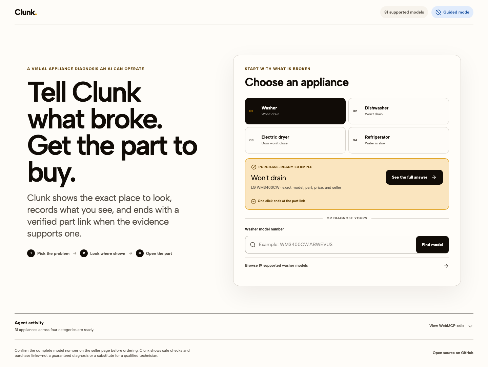

# Clunk

**Tell it what’s broken. It shows you what to check and finds the exact part.**

[Open the live repair bench](https://clunk-appliance-assistant.lovable.app) · [Watch the demo](#demo-video) · [Read the safety model](./docs/safety.md)



Clunk is a lightweight, open-source WebMCP app where a person and a browser agent diagnose one fictional washing machine together. The human supplies physical observations; the agent reads the shared state, highlights the exact component, advances a bounded diagnostic flow, and reveals a fictional compatible part. Every call updates the same interface a human can operate.

No account, API key, model call, database, server function, or runtime API is required. If WebMCP is unavailable, the full judge experience remains usable in manual mode.

> **Fictional demo only.** Clunk WM-01, its diagram, diagnoses, parts, compatibility, effort, and cost bands are original demonstration data. Do not use Clunk to diagnose or repair a real appliance.

## Judge it in 90 seconds

1. Open the [live app](https://clunk-appliance-assistant.lovable.app).
2. Select **Diagnose this washer**.
3. Report **Power is disconnected**.
4. Report **The visible hose looks clear**.
5. Report **The filter is blocked by debris**.
6. Select **Find the matching part**.

The diagram focuses the pump filter, the likely-cause ranking changes, the activity log records each action, and the fictional `CL-PF-220` pump-filter cartridge appears. Open **Tool inspector** to run the same eight bounded actions an agent can call.

For a safety path, restart and report **There is a burning smell or smoke**. Clunk ends the flow immediately and exposes no further repair step.

## Why WebMCP fits

Appliance troubleshooting happens across two worlds. An agent can reason over structured state, but only a person can safely observe the physical machine. WebMCP lets Clunk coordinate those roles without duplicating the app behind a private API:

- the agent discovers explicit, typed capabilities from the page;
- the human remains the source of physical observations;
- tool calls and human controls use one deterministic action layer;
- every accepted or rejected action is visible in the shared activity log;
- visual explanation, diagnosis, lookup, and escalation are separate tools;
- the site—not the model—enforces sequencing and safety boundaries.

The app contains eight literal `document.modelContext.registerTool({` registrations in [`src/webmcp/registerTools.ts`](./src/webmcp/registerTools.ts). Registration is progressively enhanced, lifecycle-owned by an `AbortController`, and independent of the manual interface.

## Tool surface

| Tool | Purpose |
| --- | --- |
| `get_repair_state` | Read the visible diagnosis, evidence, current safe check, ranked causes, result, and valid next actions. |
| `identify_appliance` | Select the only supported appliance, fictional `clunk-wm01`. |
| `start_diagnosis` | Start the only supported symptom flow, `will-not-drain`. |
| `highlight_component` | Move the shared diagram focus without advancing diagnosis. |
| `record_check_result` | Record one explicit human observation for the current check. |
| `show_repair_step` | Show a current or completed safe observation step. |
| `find_compatible_part` | Reveal a fictional part only after sufficient evidence exists. |
| `escalate_to_professional` | End the flow at a hazard, access, electrical, or unresolved boundary. |

Every input schema is enum-bounded with `additionalProperties: false`. The visible inspector shows each tool’s purpose and sample arguments. [`evals/webmcp-evals.json`](./evals/webmcp-evals.json) contains reproducible discovery, happy-path, visual, invalid-call, hazard, and refusal cases.

## Architecture

```text
Human control ─┐
               ├─> shared action layer ─> deterministic engine ─> repair state ─> UI
WebMCP call ───┘                                │
                                                └─> accepted/rejected activity event
```

Clunk ships as static HTML, CSS, JavaScript, JSON, SVG, and local font files. The browser agent supplies reasoning; Clunk supplies tools, authoritative state, deterministic transitions, and safety policy. See [`docs/architecture.md`](./docs/architecture.md) for the layer map and [`docs/repair-pack-schema.md`](./docs/repair-pack-schema.md) for the documented extension format.

## Deterministic safety

Clunk never provides gas, mains/high-voltage, energized, refrigerant, sealed-compressor, protection-bypass, internal-wiring, control-board, panel-removal, or professional-only repair instructions.

The site validates repair content, rejects out-of-order calls, requires explicit human observations, and enters a terminal professional state for burning smell, smoke, hot water, leaks near power, damaged access, or unsafe reach. Invalid calls are logged without advancing the diagnosis. Full policy and tested outcomes are in [`docs/safety.md`](./docs/safety.md).

## Browser setup

- **Supported WebMCP browser:** enable WebMCP in a compatible agent/browser environment. For the Chrome 149 testing build, open `chrome://flags/#enable-webmcp-testing`, enable the flag, and relaunch Chrome.
- **Any other modern browser:** Clunk reports **Manual mode ready**. Use the normal controls or the visible Tool inspector; both reach the same state and log.

The production URL was verified in ChatGPT’s in-app browser and in a connected Chrome profile with WebMCP enabled. The Chrome profile registered all eight tools; the in-app browser exercised the credential-free manual fallback.

## Run locally

Requirements: Node.js 22 or newer.

```bash
npm ci
npm run dev
```

Open `http://localhost:5173`. No environment file or external service is needed.

To run the complete quality gate:

```bash
npx playwright install --with-deps chromium
npm run verify
```

The gate runs TypeScript, ESLint, 19 deterministic unit/integration/eval tests, a production build, and 12 desktop/mobile browser checks. Browser coverage includes the canonical and hazard paths, keyboard and touch targets, responsive overflow, reduced motion, and automated WCAG A/AA checks in both initial and result states.

## Demo video

The required public YouTube demo will be linked here before the Devpost entry is finalized. The recording outline is in [`devpost-submission.md`](./devpost-submission.md).

## Built with AI, not powered by an app-side model

Codex was used to implement and test the conventional codebase, inspect the live browser experience, and prepare the open-source and Devpost materials. Lovable was used to create the hosting project and publish the static build. The shipped app itself does not call an LLM or include a model SDK, secret, or OpenAI API key.

## Contributing and license

Small, reviewable contributions are welcome; start with [`CONTRIBUTING.md`](./CONTRIBUTING.md). Safety or security concerns are covered by [`SECURITY.md`](./SECURITY.md).

MIT © 2026 Mark Costigliola. See [`LICENSE`](./LICENSE).
